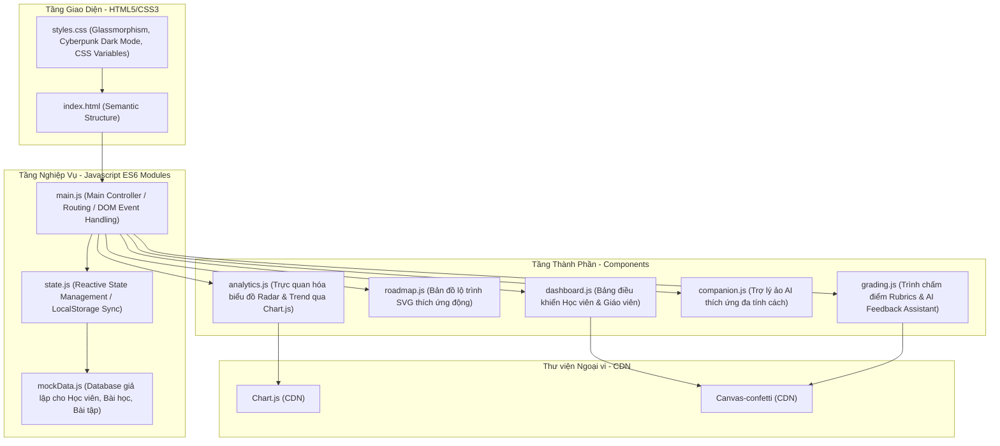

# ⚙️ Kiến Trúc Kỹ Thuật Hệ Thống AuraLMS

AuraLMS được xây dựng theo mô hình **Single Page Application (SPA)** thuần túy chạy hoàn toàn ở phía client (Client-side architecture), giúp tối ưu hóa hiệu năng, giảm thiểu chi phí máy chủ và có tốc độ phản hồi cực nhanh (131ms).

### Chi tiết các tệp nguồn chính:
- **[index.html](file:///d:/code/GFT/TrackA/index.html)**: Cấu trúc trang SPA chính, bao gồm sidebar điều hướng, header thanh chọn vai trò/học viên, các vùng chứa nội dung (panels), modal hiển thị bài giảng, và các thẻ `<canvas>` dùng cho biểu đồ. Nạp các thư viện ngoài qua CDN.
- **[styles.css](file:///d:/code/GFT/TrackA/src/css/styles.css)**: Hệ thống kiểu dáng CSS tùy chỉnh hoàn toàn (Vanilla CSS). Sử dụng các biến CSS Variables cấu hình tông màu thích ứng cho từng nhóm học sinh. Thiết kế theo phong cách Glassmorphism (`backdrop-filter: blur(14px)`) và Cyberpunk tối giản hiện đại.
- **[state.js](file:///d:/code/GFT/TrackA/src/js/state.js)**: Chứa lớp quản lý trạng thái tập trung `StateManager`. Cung cấp cơ chế đăng ký lắng nghe sự thay đổi (Reactive State/Pub-Sub pattern), tự động lưu trữ và đồng bộ hóa trạng thái hiện tại xuống `LocalStorage` (tránh mất dữ liệu khi F5 trang).
- **[mockData.js](file:///d:/code/GFT/TrackA/src/js/mockData.js)**: Lưu trữ dữ liệu cấu trúc bài giảng, câu hỏi tự luận, các tiêu chí đánh giá chi tiết (rubrics) và thông tin cơ sở dữ liệu mẫu của học viên.
- **[main.js](file:///d:/code/GFT/TrackA/src/js/main.js)**: Trình điều phối luồng chính (Main Controller). Lắng nghe tương tác của người dùng (chuyển vai trò học viên/giáo viên, chọn học sinh, click menu), kích hoạt các hàm render tương ứng của các component và xử lý nộp bài tập.
